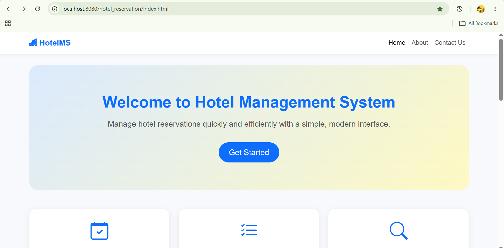
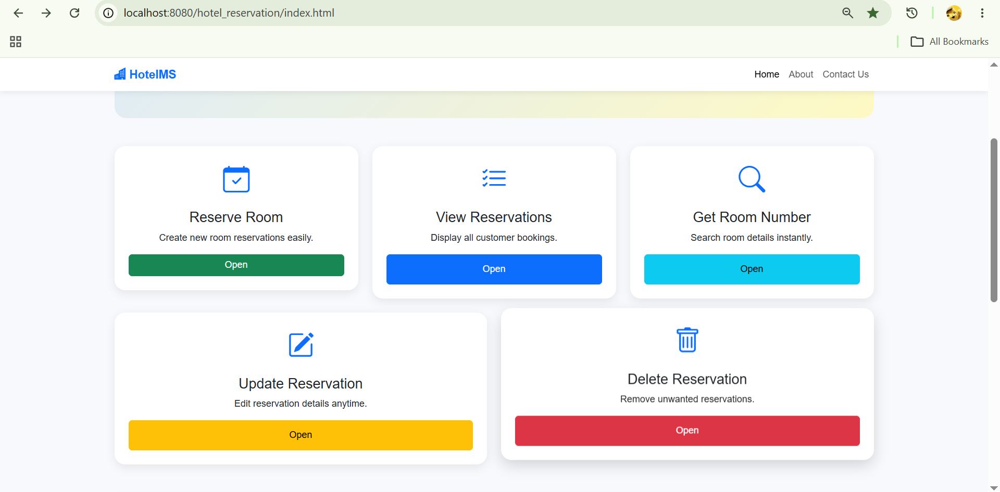
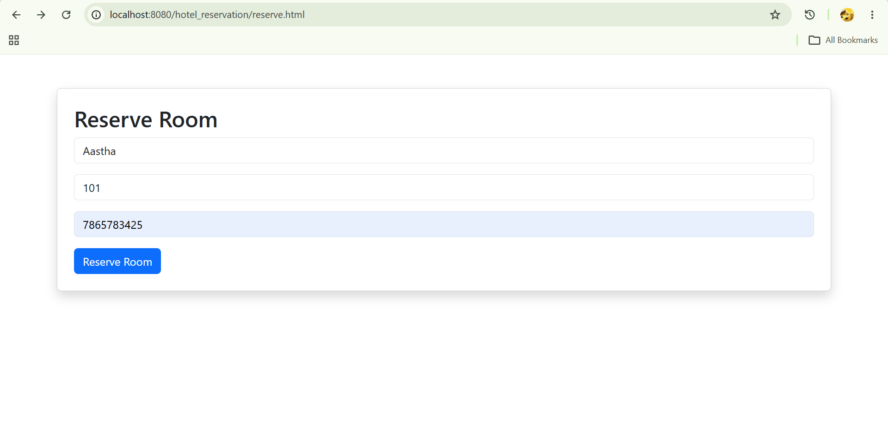
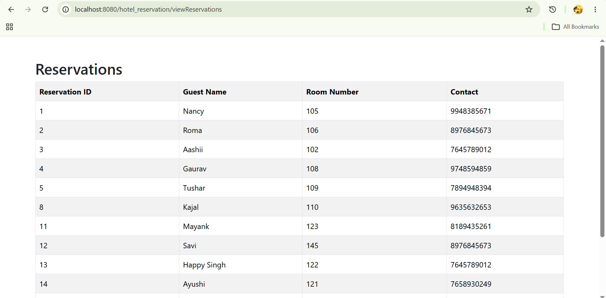
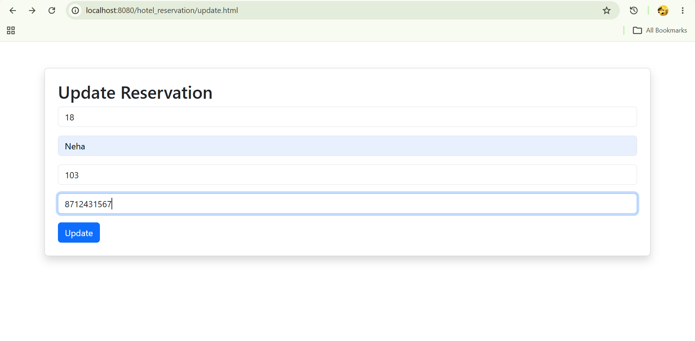
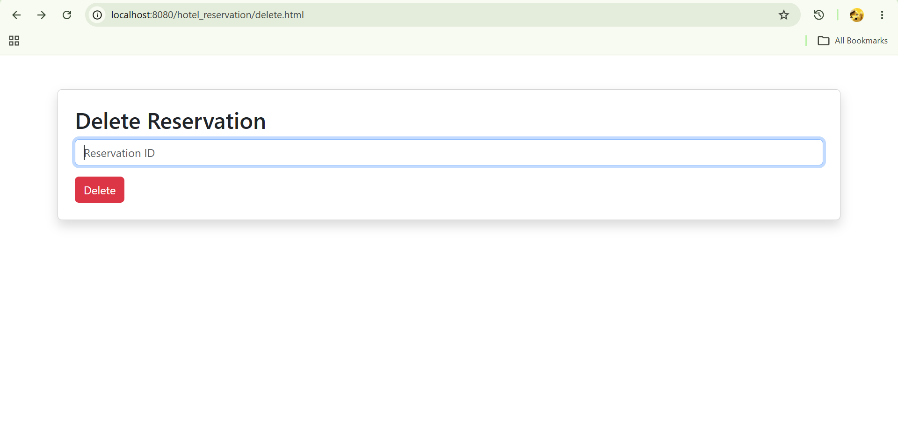
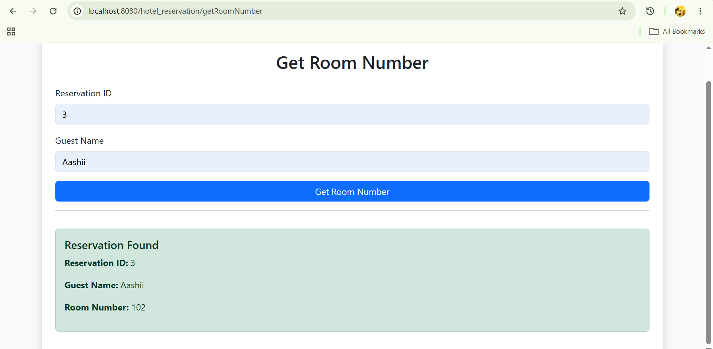
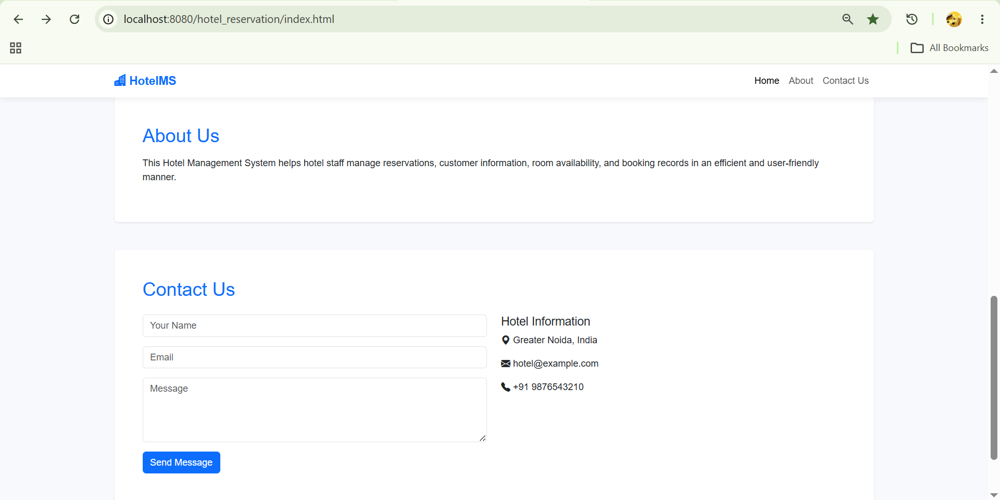

<h1 align="center">🏨 Hotel Reservation System</h1>

<p align="center">
A web-based Hotel Reservation System built using Java, Servlets, JSP, JDBC, MySQL, Bootstrap, and Maven.
</p>

---

## 🚀 Features

### ✅ Implemented

- Reserve Room
- View Reservations
- Get Room Number
- Update Reservation
- Delete Reservation

---

## 🛠️ Technologies Used

### Backend
- Java
- Servlets
- JSP
- JDBC

### Database
- MySQL

### Frontend
- HTML5
- CSS3
- Bootstrap 5

### Build & Server
- Maven
- Apache Tomcat 9

### Version Control
- Git
- GitHub

---

## 📌 Project Status

**Completed (Current Version)**

The application provides complete reservation management with Create, Read, Update, and Delete (CRUD) operations through a responsive web interface. Future enhancements are planned to improve functionality and user experience.

---

## 📂 Project Structure

```
Hotel-Reservation-System
│── screenshots
│── src
│   └── main
│       ├── java
│       ├── resources
│       └── webapp
│── pom.xml
│── README.md
```

---

## ⚙️ Prerequisites

- JDK 17 or later
- Apache Tomcat 9
- MySQL Server
- Maven
- VS Code or IntelliJ IDEA

---

## ▶️ How to Run

1. Clone the repository:

```bash
git clone https://github.com/dollylodhi6767-ops/Hotel-Reservation-System.git
```

2. Import the project as a Maven project.

3. Create the required MySQL database.

4. Update the database credentials in the project.

5. Build the project:

```bash
mvn clean package
```

6. Deploy the generated WAR file to Apache Tomcat.

7. Open the application in your browser.

---

## 📸 Screenshots

### 🏠 Home Page

<p align="center">
  
</p>

---

### ✨ Features

<p align="center">
  
</p>

---

### 📝 Reservation Module

<p align="center">
  
  
</p>

---

### ✏️ Update & Delete Reservation

<p align="center">
  
  
</p>

---

### 🔍 Get Room Number & Extras

<p align="center">
  
  
</p>

---

## 🌱 Future Enhancements

- User Authentication & Authorization
- Admin Dashboard
- Room Availability Management
- Search & Filter Reservations
- Input Validation
- Responsive UI Enhancements

---

## 👨‍💻 Author

**Dolly Lodhi**

BCA Graduate | Aspiring Java Backend Developer

🔗 **LinkedIn:**  
https://www.linkedin.com/in/dolly-lodhi

💻 **GitHub:**  
https://github.com/dollylodhi6767-ops
